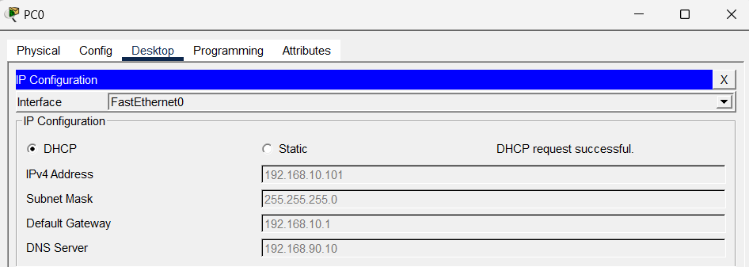
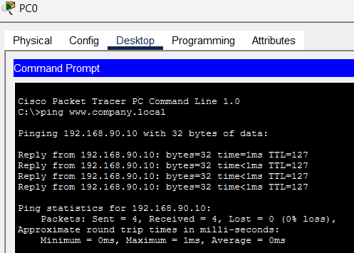
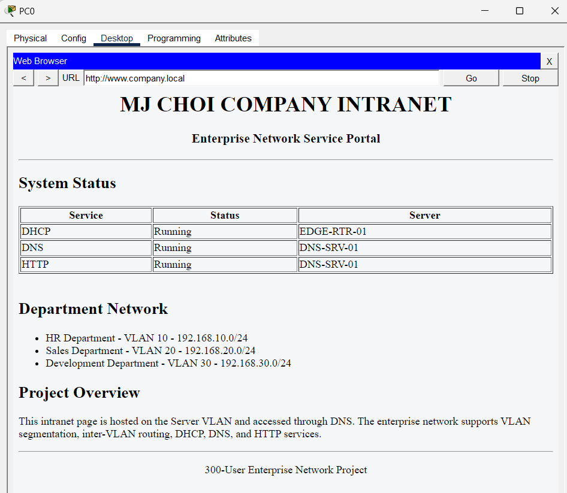
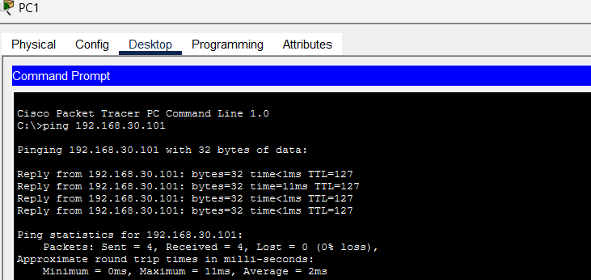

# Cisco Enterprise Network Lab

## Overview

This project simulates a small enterprise network using Cisco Packet Tracer.

The network is designed to separate departments using VLANs and provide essential network services including DHCP, DNS, and HTTP.

The project also demonstrates inter-VLAN communication through Router-on-a-Stick configuration.

---

## Topology

The following diagram illustrates the overall enterprise network architecture used in this project.

---

## Network Architecture

| Department | VLAN | Gateway |
|------------|------|---------|
| HR | 10 | 192.168.10.1 |
| Sales | 20 | 192.168.20.1 |
| Development | 30 | 192.168.30.1 |
| Server | 90 | 192.168.90.1 |

---

## Implemented Features

- VLAN Segmentation
- Router-on-a-Stick
- Inter-VLAN Routing
- DHCP
- DNS
- HTTP Service

---

## Validation

✔ Inter-VLAN communication

✔ Automatic DHCP address assignment

✔ DNS name resolution

✔ Internal web server access

---

## DHCP

## DNS

## HTTP

## PING

---

## Environment

- Cisco Packet Tracer • Cisco IOS • Cisco 2911 • Catalyst 2960

---

## What I Learned

- Implemented VLAN-based enterprise network using Router-on-a-Stick.
- Verified end-to-end connectivity through DHCP, DNS, HTTP, and Inter-VLAN routing.

---

## Future Improvements

- Implement Standard and Extended ACL
- Configure OSPF Routing
- Implement NAT
- Add Network Redundancy
