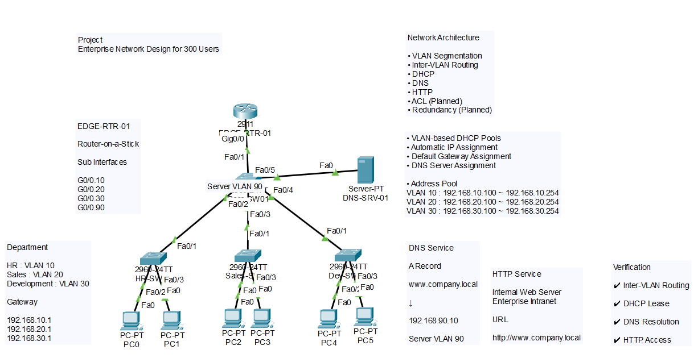

# Cisco Enterprise Network Lab

## Overview

This project simulates a small enterprise network using Cisco Packet Tracer.

The network is designed to separate departments using VLANs and provide essential network services including DHCP, DNS, and HTTP.

The project also demonstrates inter-VLAN communication through Router-on-a-Stick configuration.

---

## Objectives

- Design a segmented enterprise network
- Configure VLAN-based communication
- Implement automatic IP address allocation
- Configure internal DNS and HTTP services
- Verify end-to-end connectivity

---

## Network Topology

The following diagram illustrates the overall enterprise network architecture used in this project.

---

## Network Architecture

| Department | VLAN | Gateway |
|------------|------|---------|
| HR | 10 | 192.168.10.1 |
| Sales | 20 | 192.168.20.1 |
| Development | 30 | 192.168.30.1 |
| Server | 90 | 192.168.90.1 |

---

## Implemented Features

- VLAN Segmentation
- Router-on-a-Stick
- Inter-VLAN Routing
- DHCP
- DNS
- HTTP Service

---

## Validation

✔ Inter-VLAN communication

✔ Automatic DHCP address assignment

✔ DNS name resolution

✔ Internal web server access

---

## Environment

- Cisco Packet Tracer
- Cisco 2911 Router
- Cisco Catalyst 2960 Switch
- Cisco IOS

---

## What I Learned

- Learned how Router-on-a-Stick enables communication between multiple VLANs.
- Configured DHCP pools and verified automatic IP assignment.
- Built an internal DNS server and HTTP service for name-based web access.
- Improved troubleshooting skills by testing and verifying network connectivity.

---

## Project Files

- enterprise-network-lab.pkt
- topology.png
